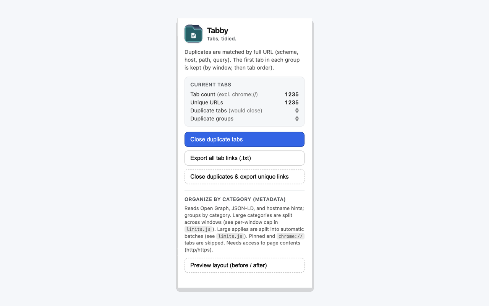

<h1>
  
  Tabby
</h1>

**Tabs, tidied.** A Chrome extension (Manifest V3) for **too many tabs**: dedupe by full URL, export links, and organize tabs into smart category batches with preview and safe limits.

## Preview

  

  <em>Chrome Web Store listing asset (<code>screenshots/tabby-cws-screenshot-1280x800.png</code>). Raw popup capture: <code>screenshots/screenshot-popup.png</code>; smaller asset: <code>screenshots/tabby-cws-screenshot-640x400.png</code>.</em>

## Features

- **Duplicate detection** — Matches duplicates by full URL (scheme, host, path, query). See counts before you change anything.
- **Close duplicates** — Keeps one tab per URL per group (by window and tab order), closes the rest.
- **Export** — Save all unique tab links as a `.txt` file.
- **Organize by category** — Uses Open Graph, JSON-LD, and hostname hints to group tabs; preview layout before moving tabs; large applies run in batches (see `limits.js`).

## Privacy

How Tabby uses permissions and on-device data is described in **[privacy-policy.md](privacy-policy.md)**.

## License

See [LICENSE](LICENSE).
